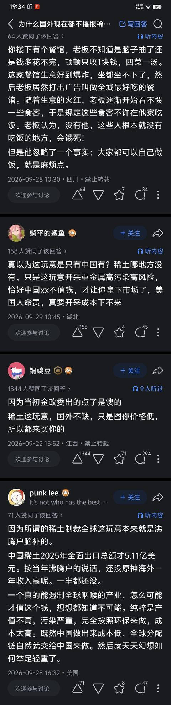
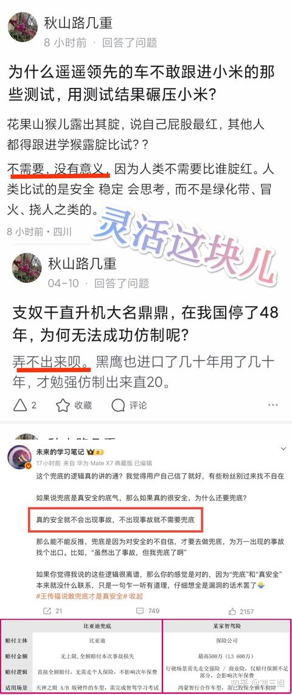

# 为什么国外现在都不播报稀土了？ - 评论区

> 共 93 条评论，导出于 2026-10-02

---

> **于可爱呀呀** · 2026-10-02 19:35 · IP 福建 · 👍 98
>
> [捂脸][捂脸]刷到的都是这样子的。。。

> > **叫我鸡哥** · 2026-10-02 19:49 · IP 湖南
> >
> > 口嗨大家都会，但是你想让资本家花钱去提炼稀土，估计要罗斯福复活

> > **ding哥** · 2026-10-02 19:47 · IP 上海
> >
> > 这没什么用，现实和虚幻宇宙总会重叠，重叠的时候那就麻烦辣

> > **我要吃炸鸡** 回复 **ding哥** · 2026-10-02 20:54 · IP 加拿大
> >
> > 当初哈哈哈哈哈哈姐在知乎造势那么大。好多人真以为他优势很大，结果摇摆州 0:7。

> > **扒那那** · 2026-10-02 19:58 · IP 黑龙江
> >
> > 岂不闻天下没有第二个同等规模的饭店[看看你]

> > **阿古斯** 回复 **叫我鸡哥** · 2026-10-02 21:02 · IP 江苏
> >
> > 罗斯福再世也不可能搞，纯亏本生意

> > **躺赢尊者** · 2026-10-03 00:02 · IP 广西
> >
> > 外面吃花1元，自己做得花100元，前期更是得花1000元才能吃上一顿[飙泪笑]

> > **知乎用户Kkz6bH** 回复 **我要吃炸鸡** · 2026-10-02 22:55 · IP 山东
> >
> > 当时真没绷任[捂脸]

> > **richard666** · 2026-10-03 00:18 · IP 黑龙江
> >
> > 你跟日子和老美说啊 你跟马斯克说啊 他还弄啥无稀土电机呢[思考]

> > **矛盾** · 2026-10-03 00:08 · IP 河北
> >
> > 3、5个人的公司和3、5十万的公司有啥可比性吗。核武器不就是核聚变 核裂变吗，探索太空不就是发射火箭送航天器嘛。多大点事啊

> > **双轮旅行** 回复 **躺赢尊者** · 2026-10-03 00:05 · IP 尼泊尔
> >
> > 路边摊预算就得几百万，搞了五六个月搞不定又加到一千万，毕竟是国运终于开起来了，但是吧，糊糊

> > **阿古斯** 回复 **叫我鸡哥** · 2026-10-02 21:02 · IP 江苏
> >
> > 这玩意是副产物，真当是直接提炼的啊[飙泪笑]

> > **路漫漫其修远兮** 回复 **阿古斯** · 2026-10-03 04:02 · IP 河南
> >
> > 大部分稀土都是直接提炼的。

> > **岳清友** · 2026-10-03 02:46 · IP 河北
> >
> > 也没说错，只不过这个不值钱的幅度比较夸张罢了。

> > **birdhuman** · 2026-10-03 06:03 · IP 海南
> >
> > 也没说错，只是得一天到晚净做饭，做了上顿做下顿，做了吃吃了做干不了别的罢了

> > **韶华** 回复 **阿古斯** · 2026-10-03 04:05 · IP 广西
> >
> > 你分得清镓和稀土吗[飙泪笑]

> > **蛙年** · 2026-10-03 01:20 · IP 浙江
> >
> > 不这样就没知乎那味儿了

> > **595959595959** · 2026-10-02 21:51 · IP 河南
> >
> > 这些都不是不学逻辑的问题了，而是常识性问题

> > **Kruskal** 回复 **richard666** · 2026-10-03 03:07 · IP 北京
> >
> > 马斯克按计划去年还上火星了呢

> > **buster Lao** · 2026-10-02 22:35 · IP 广东
> >
> > @躺平的鲨鱼 @铜豌豆 @punk lee 我大哥问你话呢

---

> **momo** · 2026-10-02 21:17 · IP 广东 · 👍 73
>
> 这台被松根油弄报废的吉普车应该是松根油的唯一战果了[doge]

> > **不知何处是他乡** · 2026-10-02 23:03 · IP 河南
> >
> > 击毁美军吉普车一辆

> > **秦決西** · 2026-10-02 23:24 · IP 福建
> >
> > 战争结束了，山本[生气]

---

> **哈吉米曼波** · 2026-10-02 21:52 · IP 吉林 · 👍 37
>
> 然后战后恢复秩序，疯狂种杉树，导致日本花粉过敏严重

---

> **知乎用户4107** · 2026-10-02 19:49 · IP 云南 · 👍 24
>
> kards又多了两张能用的卡面。

---

> **夕瓜** · 2026-10-02 19:07 · IP 江苏 · 👍 67
>
> 这时候就没人提日本绿化环保搞得好了[doge]

> > **天道神** · 2026-10-03 00:50 · IP 广东
> >
> > [大笑]松树绿叶子不多

> > **马达熊** · 2026-10-03 02:36 · IP 美国
> >
> > 搞环保要少生孩子多种树。日本人种树可能不多，但现在生孩子是真的少。

> > **周云** 回复 **马达熊** · 2026-10-03 04:39 · IP 江苏
> >
> > 日本生育率美国人笑笑就算了，中国人笑话人家生的少？

---

> **秀秀** · 2026-10-02 22:39 · IP 湖北 · 👍 8
>
> 看来水变油电影里原型是这玩意[捂脸]

---

> **细雪如米** · 2026-10-03 00:30 · IP 安徽 · 👍 6
>
> 加松果像话吗？[捂脸]跟二战后多年被中国人收留的日本老兵回乡，发现家人当年真的收到了自己的骨灰，还有墓。好奇要挖开来看看，家人拗不过挖开，发现骨灰罐子里是几块石头那事有异曲同工之妙啊。

> > **骄傲的李** · 2026-10-03 04:39 · IP 河南
> >
> > 衣冠冢听过，石头冢还是第一次听说。[大笑]

---

> **Hachimitsu** · 2026-10-03 00:58 · IP 云南 · 👍 3
>
> 什么，你要听侠客行的故事吗
> 元和二年……
> 花山家收留了一名流浪赌徒过夜。
> 当夜山贼来袭，花山全家惨遭杀害，只剩下幼子弥吉。
> 赌徒为报答一夜留宿之恩，取来寺中的铜钟，把弥吉护在钟下。
> 赌徒身中无数刀伤，五脏六腑皆被斩裂，一步不退。
> 性命早已断绝，身躯依旧屹立不倒。
> 山贼见此侠义，为之震撼，放过钟内的孩子。
>  这，便是侠客行。

> > **飞鼠溪** · 2026-10-03 05:19 · IP 江西
> >
> > 都能去庙里取来铜钟，干嘛不把孩子带走呢

---

> **SING** · 2026-10-02 22:35 · IP 云南 · 👍 2
>
> 你们说的我都无法辨别，我去别的地方玩了！

---

> **落翼** · 2026-10-02 23:39 · IP 北京 · 👍 3
>
> 那能一样吗[doge] 

---

> **黑猫警长** · 2026-10-02 21:34 · IP 湖北 · 👍 2
>
> 无可靠信源

> > **littlestake** · 2026-10-02 23:15 · IP 陕西
> >
> > [大哭]这是得多爱日本啊
> > 这么出名的事迹还要信源

> > **臭打游戏的**（作者） · 2026-10-02 22:28 · IP 黑龙江
> >
> > @知乎直答 关于松根油的原始信源是出自：1944年7月的《松根油紧急增产对策》及1945年的阁议决定《松根油等扩充增产对策》（代号“根根作战”）吗？

> > **howard** · 2026-10-02 23:19 · IP 江西
> >
> > 这算是非常出名的事迹，恐怕是台湾那边的义务教育不太行，所以不知道可以理解。

> > **专业治疗精神病人** · 2026-10-02 23:15 · IP 山东
> >
> > 你为什么不回复了呢

> > **momo** · 2026-10-02 23:21 · IP 上海
> >
> > 经典不知道等于没有，精神病性结构这一块

> > **知乎直答** 回复 **臭打游戏的** · 2026-10-02 22:29 · IP 看山的工位
> >
> > 是真的，松根油计划的官方文件对应1944年10月最高战争指导会议确定的《松根油等紧急增产对策措置要纲》，以及1945年3月日本阁议通过的《松根油等扩充增产对策措置要纲》，这个计划也俗称“根根作战”，相关官方文书目前保存在日本国会内阁文书档案中。

> > **evolution** · 2026-10-02 23:25 · IP 山西
> >
> > 小日子自己都有纪录片啊，你不看的嘛

> > **知乎直答** 回复 **臭打游戏的** · 2026-10-03 03:16 · IP 看山的工位
> >
> > 是真的，这段描述符合可考证的历史记录。日本昭和馆保留了二战末期松根油增产运动的官方档案，当时已有大量飞行员反馈松根油杂质多、燃烧不稳定，使用松根油混合燃料的飞机经常出现动力不足甚至空中熄火的情况。战后驻日美军测试时，将松根油加入吉普油箱，最终也因为油品杂质过多、积碳严重直接导致发动机报废。

> > **YBWh** · 2026-10-02 23:19 · IP 山东
> >
> > 招笑

> > **ehcs2** · 2026-10-02 23:24 · IP 美国
> >
> > 怎么不说话了

> > **晴空凝蓝** · 2026-10-03 02:00 · IP 江苏
> >
> > 活得久一点家里人都能跟你说过的。

> > **AAq** 回复 **littlestake** · 2026-10-03 01:11 · IP 上海
> >
> > 小意思，互联网武大定律：与武大越近，关系越密切，事情越魔幻。[doge]

> > **曙光女神** · 2026-10-03 01:16 · IP 湖北
> >
> > 这也要信源，那下次别人说机油天妇罗是不是也要信源？

> > **哈哈** · 2026-10-03 01:11 · IP 云南
> >
> > 算是无关联想吧，ip湖北总让我想到某个樱花树的城市

> > **黑猫警长** 回复 **曙光女神** · 2026-10-03 01:22 · IP 湖北
> >
> > 显然需要信源。提出松根炼油不奇怪，因为历史上无厘头的事情层出不穷。但是这个事情最后发展成什么样，是不可以胡乱发散的。
> > 打个比方，大家都知道鸡血疗法很离谱，但突然有个人跳出来说全国一年因为鸡血疗法死了几十万人，我当然要求信源，因为过于离谱。
> > 而这篇文章，通篇充斥离谱味道
> > 什么飞机空中熄火，发动机当场报废之类

> > **黑猫警长** 回复 **臭打游戏的** · 2026-10-03 01:23 · IP 湖北
> >
> > 有原始信源就可以飞机空中熄火，发动机当场报废，全日本木材价格暴跌吗？

> > **臭打游戏的**（作者） 回复 **黑猫警长** · 2026-10-03 03:15 · IP 黑龙江
> >
> > @知乎直答 日本松根油是否导致飞机空中熄火以及发动机当场报废的问题？
> > 如有，请提供原始信源及可靠依据

> > **应无棱** 回复 **黑猫警长** · 2026-10-03 01:47 · IP 广东
> >
> > 转进如风[飙泪笑]

> > **海博** · 2026-10-03 00:48 · IP 江苏
> >
> > 还狗叫吗

> > **幕后主使姆巴佩** · 2026-10-03 01:36 · IP 美国
> >
> > 跟地平论信徒坐一桌

> > **晓月正阳** · 2026-10-03 00:46 · IP 广东
> >
> > 叫？

> > **wnxuxy2** · 2026-10-02 23:45 · IP 山东
> >
> > 知乎常见的理中客也够，招笑[大笑]

---

> **nodkane** · 2026-10-02 21:18 · IP 广东 · 👍 1
>
> 他跟小岛秀夫有什么关系[捂脸]（秀雄、秀夫都是读ひでお）

> > **塔.拉夏** · 2026-10-03 00:15 · IP 河南
> >
> > 大概跟你和张伟王强的关系差不多[捂脸]

---

> **好啊** · 2026-10-03 04:19 · IP 英国 · 👍 1
>
> 如果真的那么简单，为什么大家都不用这个替代品

---

> **湖北刘四** · 2026-10-03 00:01 · IP 江苏 · 👍 1
>
> 没看明白，意思是美国自己搞稀土来打破中国稀土封锁，肯定不会成功？

> > **梧桐树** · 2026-10-03 05:51 · IP 江苏
> >
> > 大概就是你的意思。稀土矿美国也有，缺的是提炼。而大规模提炼稀土，除非美国能忍受几十倍的成本加持续很多年的工业再建设，不然就跟日本搞松根油一样，全民狂热一阵，然后屁用没有，或者仅仅是有点屁用。

---

> **季牧师** · 2026-10-02 21:17 · IP 江苏 · 👍 99
>
> 现在日本花粉过敏的人很多，也和这个有关，树都砍光了，为了快速恢复植被，战后种的都是速生树，结果这些树都很容易传播花粉。

> > **王二不是王大** · 2026-10-02 21:37 · IP 广东
> >
> > 还有这个来源[大笑]

> > **朔云孤月** · 2026-10-02 22:55 · IP 上海
> >
> > 看历史学的好还是有不少好处的[捂脸]

> > **恰特基披梯** · 2026-10-02 22:52 · IP 广东
> >
> > 一环扣一环[doge]

> > **杨帆** · 2026-10-02 23:52 · IP 云南
> >
> > 花粉少女注意报中亦有记载[doge]

---

> **人均百万** · 2026-10-02 20:34 · IP 美国 · 👍 1
>
> 糖

> > **傲娇的狐狸** · 2026-10-02 21:35 · IP 河北
> >
> > 所以为什么现在还没量产稀土？

> > **595959595959** · 2026-10-02 21:52 · IP 河南
> >
> > 你要觉得他说的不对就拿出证据反驳人家，这样只会让别人觉得你很“甜”

> > **商鞅知马力** · 2026-10-02 21:50 · IP 江苏
> >
> > 这个时候不说尊重遗传病患者了。[大笑]

> > **半芥过客** · 2026-10-03 02:22 · IP 河南
> >
> > 

> > **Kruskal** 回复 **人均百万** · 2026-10-03 03:08 · IP 北京
> >
> > 你最糖

> > **人均百万** 回复 **傲娇的狐狸** · 2026-10-02 21:50 · IP 美国
> >
> > 糖

> > **人均百万** 回复 **595959595959** · 2026-10-02 22:05 · IP 美国
> >
> > 你也很糖

> > **开始练字** · 2026-10-03 01:27 · IP 重庆
> >
> > 宝批龙

---

> **万树梅花月满天** · 2026-10-03 02:32 · IP 北京 · 👍 0
>
> 要有这好事儿，为啥不报道啊

---

> **meridjan** · 2026-10-02 23:05 · IP 山东 · 👍 0
>
> 前阵子电视剧《家业》里边用这个来烧烟做墨

---

> **蓝疗心理** · 2026-10-02 21:06 · IP 山西 · 👍 0
>
> 令人开心

---

> **赵宇** · 2026-10-03 03:05 · IP 北京 · 👍 0
>
> 如果我要是穿越到古代了，挖松根炼油造内燃机有希望么？ @知乎直答

> > **赵宇** 回复 **知乎直答** · 2026-10-03 03:55 · IP 北京
> >
> > 那穿越到古代，比如明朝中期，如果想搞燃油的话有什么比较可行的路子呢？

> > **知乎直答** 回复 **赵宇** · 2026-10-03 03:56 · IP 看山的工位
> >
> > 最可行的路子是直接开采天然石油，明朝中期已有成熟的开采记录，正德年间嘉州开盐井时就已经发现石油，后来当地人专门凿井采油，官府也主导开发，用来点灯成本只有普通植物油的一半，照明效果还更好。要是你需要能用在内燃机的燃油，利用明朝的手工条件可以做出简单分馏得到初级成品油，但做不了现代标准的精细提纯，可以凑合用但没法长期稳定运行。
> > 
> > 如果找不到可开采的油田，也可以靠明朝已经成熟的榨油技术大规模压榨植物油，当时胡麻、油菜籽、黄豆等都能榨油，出油率稳定，技术成熟不需要从零摸索，性价比比挖松根炼油高太多了。

> > **知乎直答** · 2026-10-03 03:06 · IP 看山的工位
> >
> > 希望非常渺茫。首先出油率极低，40吨干松根才能提取出一吨粗油，要满足内燃机持续使用得挖秃整座山，人力成本完全扛不住。而且粗制松根油杂质多质量差，哪怕你攒够油、造出了符合精度要求的内燃机，用不了几次发动机就会报废，古代也做不了现代的精细提纯，实在得不偿失。

---

> **lilee** · 2026-10-02 23:22 · IP 海南 · 👍 0
>
> 实际上，松树本来就能产油，不用挖树，就能产油！

---

> **jarry tom** · 2026-10-03 03:06 · IP 广东 · 👍 0
>
> 看见这样的文章我就很高兴[赞同]

---

> **向北** · 2026-10-03 05:54 · IP 内蒙古 · 👍 0
>
> 日本松根没了，日本松茸也就没了。没了想吃怎么办呢，从中国进口呗

---

> **杜朗护盾** · 2026-10-03 03:28 · IP 广东 · 👍 0
>
> 这时候没人提朝花夕拾了

---

> **自然卷的家伙都不坏** · 2026-10-03 05:48 · IP 福建 · 👍 0
>
> 应该技术不到位

---

> **鄙上观** · 2026-10-02 21:22 · IP 日本 · 👍 0
>
> 日本每天能产油 4000 桶，不到自己消费量的百分之一[捂脸][捂脸][捂脸] 日本有没有大型油田，每天的产量是多少？

---

> **打不死就说** · 2026-10-03 06:53 · IP 天津 · 👍 0
>
> 跟太平天国最后吃土一样。被打傻了

---

> **artist** · 2026-10-03 00:40 · IP 河北 · 👍 0
>
> 不当人类又一罪证，不仅侵略亚洲，还严重破坏森林

