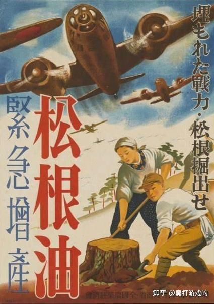
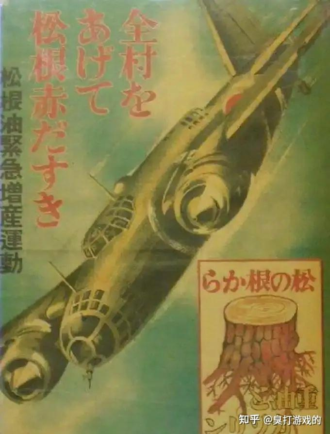

因为大家发现现在美国提取稀土，已经像日本当年的“[松根油](https://zhida.zhihu.com/search?content_id=799910479&content_type=Answer&match_order=1&q=%E6%9D%BE%E6%A0%B9%E6%B2%B9&zhida_source=entity)”一样，属于在无用的事情上白费力气了………

**什么？你还想再听一遍松根油的故事？**

真拿你没办法…坐好了：

日本在二战末期仍然负隅顽抗的时候，当时的日本驻德国海军武官小岛秀雄少将提出，通过“干馏”工艺可以从松树根中提取松根油，再经过蒸馏和混合酒精，可以制成航空汽油的代用品。

这份电报让日本大本营（特别是海军省军需局）大喜过望，将其视为救命稻草，随即开始在国内咨询林业部门和科学家进行验证。

## 为了迎合军部，专家们信誓旦旦的说200个松树根能让一架战斗机飞1小时，每多挖一个树根/多铲一块松树皮就能多让美军吃一个憋。

军部马上发布命令，全日本瞬间全民狂热挖松树根。

后来不知怎么回事被陆军本部给打听到了，陆军以为海军秘密研究出了啥高科技，觉得不能让海军马鹿争先了，于是在各地成立了许多“挺身隊”都去挖松树根，后发先至，产量很快超越海军。

当时日本至少有1200万棵松树被连根拔起，很多树龄超过300年的古松也被去根。1944年当时京都一项名为“[五山送火](https://zhida.zhihu.com/search?content_id=799910479&content_type=Answer&match_order=1&q=%E4%BA%94%E5%B1%B1%E9%80%81%E7%81%AB&zhida_source=entity)”的传统民俗活动，被京都市政府以“防空演习”和“节约物资”为由，被迫取消。

日本在饥荒和油荒的同时史无前例的陷入木材恐慌，木材价格暴跌，紧接着国民经济雪上加霜。

由于松树几乎被砍伐干净，且品控不严，陆军甚至在松根油里加入松果等副产品，陆军本部大怒，枪毙了一些虚报成绩的中底层军官，差点导致“下克上”。

直到日本投降，松根油总产量不到3万桶燃料，且40吨干松根才能提取出一吨粗根油。

而日本在战争期间的石油消耗量超过1.5亿桶。而且质量非常之烂，飞行员表示飞机经常“空中熄火”，差点机毁人亡。

到了战后，驻日美军在吉普车上尝试着用了一下松根油，**发动机当场报废**。

---

> [查看评论区](./%E4%B8%BA%E4%BB%80%E4%B9%88%E5%9B%BD%E5%A4%96%E7%8E%B0%E5%9C%A8%E9%83%BD%E4%B8%8D%E6%92%AD%E6%8A%A5%E7%A8%80%E5%9C%9F%E4%BA%86%EF%BC%9F-%E8%87%AD%E6%89%93%E6%B8%B8%E6%88%8F%E7%9A%84%E7%9A%84%E5%9B%9E%E7%AD%94-%E8%AF%84%E8%AE%BA.md)
