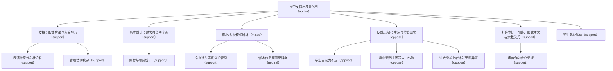

# 议题树：如何看待现在县城的中学逐渐衰弱？

- 答主：默默的莫莫
- 来源：https://www.zhihu.com/question/12137646002/answer/2087903082986344475
- 说明：以答主回答为根；主干为回答要点与评论主线，分支为评论引申议题。

## 图谱（Mermaid）

## 文字树

## 县中反快乐教育批判
立场标记: `author`

答主核心：县中模式不是真正应试教育，而是用无限延长时间掩盖管理低效，只问学生凭什么舒服，不问能否提分。

### 支持：低效应试与表演努力
立场标记: `support`  
引用评论: `11586268415`, `11586727588`, `11586552626`, `11586732026`, `11587408383`, `11587656288`

大量评论认同县中做法荒唐，是用战术勤奋掩盖战略懒惰，甚至既不快乐也不教育。

#### 表演给家长和社会看
立场标记: `support`  
引用评论: `11586552626`, `11587588147`, `11589020470`, `11588082426`

严管是为了让家长看到学校尽力，失败后也可归因于学生不努力。

#### 管理替代教学
立场标记: `support`  
引用评论: `11586431824`, `11587892912`, `11587408383`

管比教简单，学校用军事化管理掩盖教育能力不足。

### 历史对比：过去教育更全面
立场标记: `support`  
引用评论: `11587070879`, `11587285674`, `11586759698`, `11586789350`, `11587735616`

评论回忆上一辈读书时教材全面、竞争较小，吃透教材即可考好，如今加码毫无必要。

#### 教材与考试脱节
立场标记: `support`  
引用评论: `11586759698`, `11586789350`, `11587548306`, `11587458247`

现在教材防自学、出题人另起炉灶，导致题海低效刷熟练度。

### 衡水/名校模式辨析
立场标记: `mixed`  
引用评论: `11587181118`, `11587009815`, `11587408105`, `11587979085`

有评论指出衡水反而保证睡眠、限制无效熬夜，真正极端的是学衡水只学跑操和早起。

#### 冷水洗头等反常识管理
立场标记: `support`  
引用评论: `11587181118`

以磨炼意志为名损害健康，连工具理性都不符合。

#### 衡水作息反而更科学
立场标记: `neutral`  
引用评论: `11587009815`, `11587979085`

衡水强制8小时睡眠和午休，很多普通高中作息更差。

### 反对/质疑：生源与监管现实
立场标记: `oppose`  
引用评论: `11586551029`, `11588039486`, `11588323467`, `11588505436`

部分评论认为县城生源差、家庭监管缺失，学校严管是无奈兜底，不能简单归因于管理低效。

#### 学生自制力不足
立场标记: `oppose`  
引用评论: `11586551029`, `11587080030`, `11586977018`

县城多数学生缺乏自律，留空闲就会放飞，学校不得不承接监管。

#### 县中衰弱主因是人口外流
立场标记: `oppose`  
引用评论: `11588323467`

县城没人了，中学自然萎缩，与教育模式关系不大。

#### 过去能考上者本就天赋异禀
立场标记: `oppose`  
引用评论: `11588118956`

当年大学生是筛选出的少数，不能证明教育模式更优。

### 社会类比：加班、形式主义与宗教仪式
立场标记: `support`  
引用评论: `11588640977`, `11586899926`, `11587227518`, `11587873417`, `11588229381`

评论将县中模式类比企业无效加班、形式主义表演和宗教仪式，强调痛苦本身成为目的。

#### 痛苦作为安心凭证
立场标记: `support`  
引用评论: `11587227518`, `11589020470`

只有学生痛苦，老师家长才确认自己在努力。

### 学生身心代价
立场标记: `support`  
引用评论: `11586930472`, `11587181118`, `11587357130`, `11588404786`

评论列举睡眠不足、偏头痛、考试前夜读等案例，批评反快乐教育损害健康且无提分效果。
