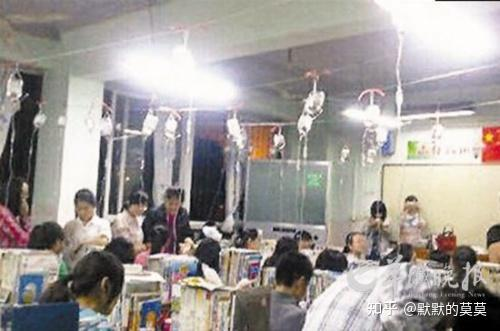

“反快乐教育”，这个说法太切中要害了。

还记得那个著名的“[吊瓶班](https://zhida.zhihu.com/search?content_id=799454534&content_type=Answer&match_order=1&q=%E5%90%8A%E7%93%B6%E7%8F%AD&zhida_source=entity)”吗？现代版的悬梁刺股，最后连一个一本都没出。

过去我们批评应试教育，其实默认了一个前提：学校虽然功利，但至少是讲投入产出比的。目标是高考，那就研究高考；哪种训练有效就做哪种训练，哪种训练无效就砍掉。它很狭窄，但它至少还服从一种工具理性。

而以县中为代表的“反快乐教育”连这个都不是。

它不是问：

**“这样做能不能让你多考10分？”**

而是问：

**“你凭什么过得这么舒服？”**

这两个问题看起来只差一点，背后却是两套完全不同的教育哲学。

真正极端的应试学校，反而未必愿意让学生无效地熬十四个小时。假如睡足八小时能提高记忆效率，它就应该让你睡；假如跑半小时步能提高注意力，它就应该让你跑；假如一个成绩稳定在年级前十的孩子晚上九点半回去睡觉比熬到十二点效果更好，纯粹从“提分机器”的角度看，也应该放他回去。

教育部早在2021年就要求高中生每天保证8小时睡眠，而且明确把睡眠和记忆巩固、学习效率联系起来。到了2025年的《县域普通高中振兴行动计划》，又专门要求县中“防止超长时间学习和挤占正常休息时间”，保障课间、午休、晚间睡眠以及自主学习活动时间。

所以有些地方最荒唐之处恰恰在这里：

**它甚至不是优秀的应试教育，而是低效的应试教育。**

早晨五点半起床，晚上十点半下晚自习，桌上摞着四十厘米高的卷子，走廊上贴着“只要学不死，就往死里学”，这些东西非常容易复制。

真正难复制的是什么？

是优秀教师，是课程设计，是针对性的反馈，是学生之间高质量的竞争环境，是学校准确判断一个孩子到底卡在哪里的能力，是老师知道什么时候应该继续练、什么时候应该停。

于是就出现一种很熟悉的现象：

**一所普通学校学名校，最后没有学到名校为什么能考得好，只学会了名校几点起床。**

这在社会学上其实一点都不奇怪。

因为**时间是最便宜的教育资源。**

请一个真正优秀的数学教师很贵。

建立一个成熟的教研体系很难。

给每个学生个性化反馈更难。

但是要求全体学生晚上再坐两个小时，几乎不要成本。

管理者只需要把门锁上。

**所以很多所谓“严格管理”，不是什么值得吹嘘的本事，本质上是用无限延长时间来弥补自身管理能力的不足**。

---

> [查看评论区](./%E5%A6%82%E4%BD%95%E7%9C%8B%E5%BE%85%E7%8E%B0%E5%9C%A8%E5%8E%BF%E5%9F%8E%E7%9A%84%E4%B8%AD%E5%AD%A6%E9%80%90%E6%B8%90%E8%A1%B0%E5%BC%B1%EF%BC%9F-%E9%BB%98%E9%BB%98%E7%9A%84%E8%8E%AB%E8%8E%AB%E7%9A%84%E5%9B%9E%E7%AD%94-%E8%AF%84%E8%AE%BA.md)
